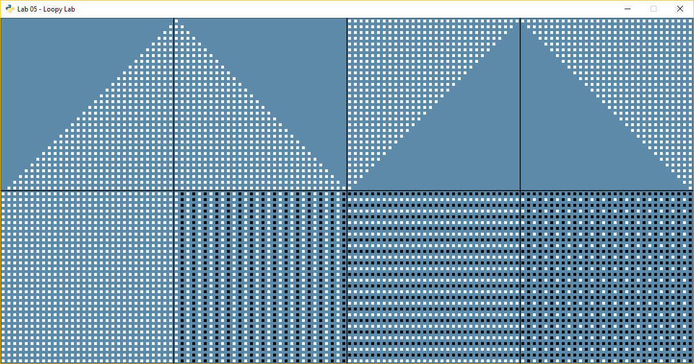
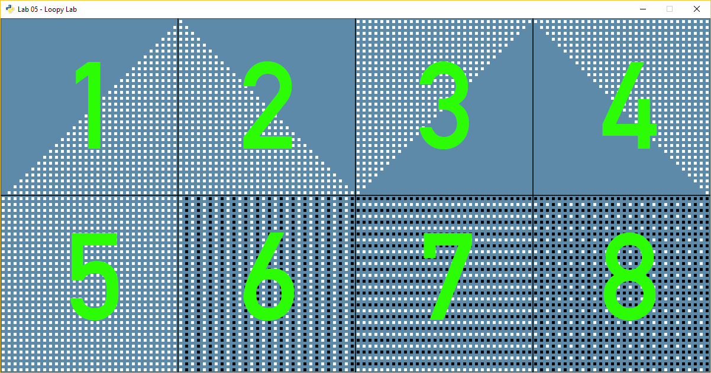

# Loopy Lab
## Learning Objectives
In this task, you will apply your understanding of `for` loops, `if` statements, and nested loops to form visually-interesting patterns.

## Task Description
Create a program using Pygame and Python to generate the following single image:

For sanity's sake, we will give a number to each section. If you have questions, you can use this numbering to refer to a specific section. 

*Do not put these numbers in the final program.*

## Template File
The template file `loopy_lab.py` has already been set up for you with a 1200 by 600 screen. You can assume each sector is a 300 by 300 pixel square.

## Techniques
- Use nested `for` loops and `if` statements to create all of these patterns. Avoid using `while` and manually-incremented counters where a `for`/`range()` function is possible. Sse [this note](https://github.com/davecheng-ste/ICS3U-Pygame-Patterns-Hints?tab=readme-ov-file#other-hints) for an example of equivalent programs using `for` and `while` statements.
- Use the [`pygame.draw()`](https://www.pygame.org/docs/ref/draw.html) function to create your graphics. An single rectangle has been drawn for you in the `loopy_lab.py` as an example, but you can also use other methods as long as the result is appropriate.

## Submission
- Commit changes for *each section* as you complete them. Make sure to write meaningful commit messages.
- Sync or push your changes at the end of every work session or class.
- Finally, take a screenshot of your finished window and upload it to Google Classroom.

## Evaluation
- *Level 2* - 4 sections
- *Level 3* - 6 sections
- *Level 4* - 8 sections